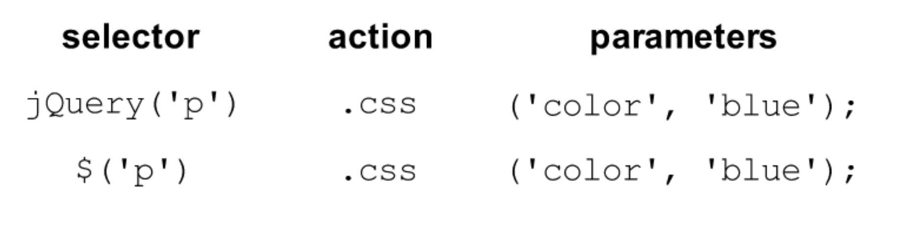

# Introduction to jQuery
---
---


### Overview

* What is jQuery?
* What is a library
* Including jQuery correctly
* Selectors
* Manipulating the DOM

## What is jQuery? (5 min)
*'jQuery is a cross-platform JavaScript library designed to simplify the client-side scripting of HTML. jQuery is the most popular JavaScript library in use today, with installation on 65% of the top 10 million highest-trafficked sites on the Web'* - **Wikipedia**

In short, jQuery is a library created to make front-end web development across different browser easier.


## What is a Library? (5 min)

Group Discussion: What do you think a **software library** means?

A library is a collection of pre-written functionalities that makes your life easier as a programmer.  

## Loding jQuery (15 ~ 20 min)

#jQuery basics
---
---

Let's start with creating a new directory:

```bash
mkdir jquery_basic
cd jquery_basic
```

#### Let's get jQuery

* Add the html file to this folder, and open it in an editor.
* Download jQuery-2.1.4.js: <https://jquery.com/download>
* Add the link to `<head></head>`

`<script type="text/javascript" src="jquery-2.1.4.js"></script>`

How to we know jQuery is loaded?
---

Open the html file in Chrome, in a cousol, type: `jQuery`

You should see something like 

```javascript
function( selector, context ) {
		// The jQuery object is actually just the init constructor 'enhanced'
		// Need init if jQuery is called (just allow error to be thrown if not included)
		return new…
```

Let's take a look at `function(selector, context){...`
 
Give this a try, in a console, type `$`

It's the same thing! In jQuery, `$` is a shortcut for `jQuery`.

A lot of modern broswers has $ baked in

### YOU DO (5 ~ 10 min)
* In your .html file , get rid of the link to your link to jQuery
* Following the instruction on the jQuery website, load it from MaxCDN or Google

`<script src="https://ajax.googleapis.com/ajax/libs/jquery/2.1.4/jquery.js"></script>`

### DISCUSSION (5 min)

Which method of loading is better? 


Selectors: The power of JQuery  (15 min)
---

Using what we know so far, how do we select the cells?

Something like:

```javascript
document.querySelector('.cell')
```

In jQuery, we simply use: `jQuery('.cell')` or better yet, `$('.cell')`

In a console, try:

```javascript
$('.cell'); //returns array
$('.row'); //returns array
```

### YOU DO (5 min)
Write a `for` loop that console.log() each cell

Star with:

```javascript
for(var i = 1; i<=9; i++{
	// your code here
}
```

### Selecting using CSS Hierarchy

In a console, try:

```javascript
$('#row1 #cell1')
```
```javascript
$('#row1 > #cell1')
```

### How do we get the inner content?

How do we get the inner content of a `cell1` right now?

We need something like `document.querySelector('#cell1').innerText`

Did you know this doesn't work in Firefox?

In Firefox, we need something like `document.querySelector('#cell1').textContent`

How do we do this in jQuery? Try: 

```javascript
$('#cell1').text();
```

And it works **everywhere**!

### Taxonomy of a jQuery command




### YOU DO (5 min)
Using the `for` loop above, output the text in every square

### How do we set in content?

Similar to getting values, jQuery offers us an amazingly simple way of setting the text. 

Instead of 

```javascript
document.querySelector('#cell1').innerText = 'A';
```

We simply do

```javascript
$('#cell1').text('A');
```

**QUESTION:** what are the name of `$('#cell')`, `.text`, and `('A')`?

### YOU DO (5 min)

Look up another method in jQuery that allows us to loop through an array, and use that to change the content of each box

---

# jQuery Pt.2

## Add/Remove Classes (10 ~ 15 min)

One of the most common coding practice of front-end web development is to add/remove class. As always, jQuery offers us great and simple methods.

First, let's see how we can retrieve the class of an given element.

In a console, type:

```javascript
$('#cell1').attr('class');
```

#### Quick You Do

Get `id` instead of `class`

**Quick We Do:** How do we add a class?

Answer: `$('#cell1').addClass('selected');`

**Quick We Do:** How do we remove a class?

Answer: `$('#cell1').removeClass('selected');`

If only there is a way to do this **even** easier...

**Question:** Is there another way to add/remove class in jQuery?
Answer: `$('#cell1').toggleClass('selected');`

## Hide and Show Elements (10 ~ 15 min)

**Question**: Besides add/remove class, what's another action that we see often in front-end development? 

Answer: Hiding and showing elements

**Question**: How do we hide and show elements using CSS? 

Answer: `display: none` or other options

Wouldn't it be nice if we have a function that does this for us? 

***jQuery to the rescue***

In a console, try:

```javascript
$('#cell1').hide();
```

What happened??

Type in `$('#cell1')`

We can see that it's still there, but the `style` has changed to `display: none`

Now let's get it back.

***Question:*** How do we bring it back? 

Answer: `$('#cell1').show()`

### You Do (5 min)
Hide all the odd boxes, don't use a `for` loop


## Adding Event Listeners (15 ~ 20 min)

**Question:** What's the last thing we need to know how to do before jQuery becomes our savior?

**Answer:** We need to be able to add event listeners

**Quick We Do (5 min):** Let's add an event listener using vanilla JS that adds a class `'selected'` to the 1 box when it is clicked

```javascript
document.querySelector('#cell1').addEventListener('click', function(){
	this.className += ' selected';
})
```

How do we do this in jQuery?

In the console, first let's select the elemnt: `$('#cell1')`

Now, try: 

```javascript
$('#cell1').on('click', function(){
	$(this).addClass('selected');
})
```

###Question
Why do we need `$(this)` instead of just `this`?

Answer: let's try console logging `this`, it's not a jQuery object and doesn't have any of the functionlities. `$(this)` add all the jQuery features to `this`

### We Do (10 min)
Add an event listener to each box that toggles the class `selected`

### Question #1 (5 min)
clicking happens a lot, does jQuery have a special command for it?

**Answer**: Let's try `.click()`

```javascript
$('#cell1').click(function(){
	$(this).addClass('selected');
})
```

###Quetsion #2
Given what you know, start thinking about how you can rewrite your Tic-Tac-Toe game or calculator using jQuery
