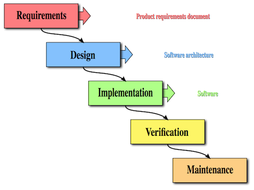
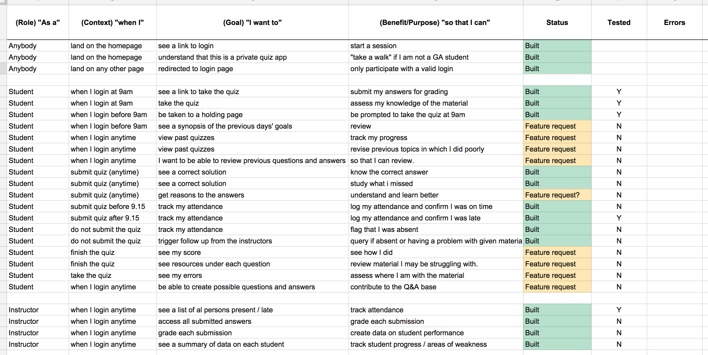
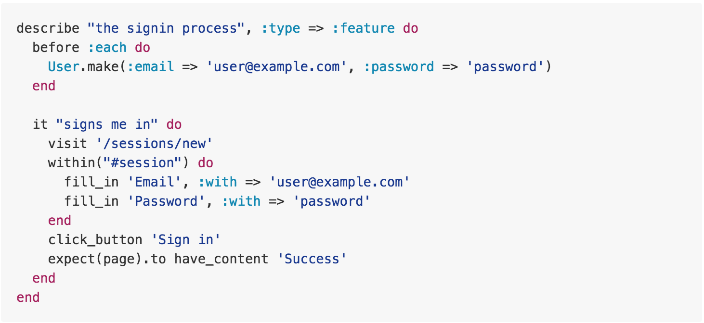

#Agile Development, User Stories

##Agile v Waterfall

#####Waterfall

>The waterfall model is a sequential design process, used in software development processes, in which progress is seen as flowing steadily downwards (like a waterfall) through the phases of Conception, Initiation, Analysis, Design, Construction, Testing, Production/Implementation and Maintenance. ~ [Wikipedia](http://en.wikipedia.org/wiki/Waterfall_model)

Waterfall is a good example of a linear methodolgy. This has benefits, but other methodologies have evolved as the need for greater flexibility has arisen. 

#####Agile

>Agile software development is a group of software development methods in which requirements and solutions evolve through collaboration between self-organizing, cross-functional teams. It promotes adaptive planning, evolutionary development, early delivery, continuous improvement, and encourages rapid and flexible response to change ~ [Wikipedia](http://en.wikipedia.org/wiki/Agile_software_development)

#####The agile manifesto

Individuals and interactions: self-organization and motivation are important, as are interactions like co-location and pair programming.
Working software: working software is more useful and welcome than just presenting documents to clients in meetings.
Customer collaboration: requirements cannot be fully collected at the beginning of the software development cycle, therefore continuous customer or stakeholder involvement is very important.
Responding to change: agile methods are focused on quick responses to change and continuous development

The core principles remain the same 

* Iterative, incremental and evolutionary
* Efficient and face-to-face communication
* Very short feedback loop and adaptation cycle
* Quality focus
* Adaptive vs. predictive
* Iterative vs. waterfall
* Code vs. documentation

#####Agile practices

"Agile development is supported by a bundle of concrete practices suggested by the agile methods, covering areas like requirements, design, modeling, coding, testing, project management, process, quality, etc. Some notable agile practices include" (wiki)

---

#####Important agile practices (for WDI curriculum)

LAB: each student is to make notes on the following:

* TDD
* CI
* Information radiators
* Pair Programming
* Planning Poker
* Refactoring
* Scrum Meetings
* User Personas
* User Stories
* Velocity tracking
* Wireframes

(10 minutes)

---

#####Important agile practices (for WDI curriculum)
* **Test-driven development** (TDD) is a software development process that relies on the repetition of a very short development cycle: first the developer writes an (initially failing) automated test case that defines a desired improvement or new function, then produces the minimum amount of code to pass that test, and finally refactors the new code to acceptable standards.
* **Continuous integration** (CI) ~ is the practice of merging all developer working copies with a shared mainline several times a day. It was adopted as part of extreme programming (XP), which did advocate integrating more than once per day, perhaps as many as tens of times per day. The main aim of CI is to prevent integration problems, referred to as "integration hell" in early descriptions of XP. CI isn't universally accepted as an improvement over frequent integration, so it is important to distinguish between the two as there is disagreement about the virtues of each. During WDI we will look at [Travis CI](https://travis-ci.com/) as an example of Continuous Integration.
* **Information radiators** (Scrum board, task board, burndown chart, **stand ups**)
* **Pair programming** ~ (sometimes referred to as peer programming) is an agile software development technique in which two programmers work as a pair together on one workstation. One, the driver, writes code while the other, the observer, pointer or navigator, reviews each line of code as it is typed in. The two programmers switch roles frequently.
* **Planning poker** ~ also called Scrum poker, is a consensus-based technique for estimating, mostly used to estimate effort or relative size of development goals in software development. In planning poker, members of the group make estimates by playing numbered cards face-down to the table, instead of speaking them aloud. The cards are revealed, and the estimates are then discussed. By hiding the figures in this way, the group can avoid the cognitive bias of anchoring, where the first number spoken aloud sets a precedent for subsequent estimates [Firepoker](http://firepoker.io/#/)
* **Refactoring** Code refactoring is the process of restructuring existing computer code – changing the factoring – without changing its external behavior. Refactoring improves nonfunctional attributes of the software.
* **Scrum meetings** (Sprint planning, daily scrum, sprint review and retrospective, **STAND UPS**)
* **User personas** In user-centered design and marketing, personas are fictional characters created to represent the different user types that might use a site, brand, or product in a similar way.[1] Marketers may use personas together with market segmentation, where the qualitative personas are constructed to be representative of specific segments.=
* **User story** is a description consisting of one or more sentences in the everyday or business language of the end user or user of a system that captures what a user does or needs to do as part of his or her job function. User stories are used with agile software development methodologies as the basis for defining the functions a business system must provide, and to facilitate requirements management. It captures the 'who', 'what' and 'why' of a requirement in a simple, concise way, often limited in detail by what can be hand-written on a small paper notecard.
* **Velocity tracking** is the act of measuring said velocity. The velocity is calculated by counting the number of units of work completed in a certain interval, the length of which is determined at the start of the project. [Pivotal Tracker](http://www.pivotaltracker.com/)
* **Wireframes** A website wireframe, also known as a **page schematic** or **screen blueprint**, is a visual guide that represents the **skeletal framework** of a **website**.

##Wireframes

>A website wireframe, also known as a **page schematic** or **screen blueprint**, is a visual guide that represents the **skeletal framework** of a **website**. ~ Wikipedia

[...continued...] **Wireframes** are created for the purpose of arranging elements to best accomplish a particular purpose. The purpose is usually being informed by a business objective and a creative idea. The wireframe depicts the **page layout** or **arrangement** of the website’s **content**, including **interface elements** and **navigational systems**, and how they work together. The wireframe usually lacks typographic style, color, or graphics, since the main focus lies in **functionality**, behavior, and priority of content.

#####Key points to get across

* Information design
* Navigation design
* Interface design

#####Wireframes focus on:

* The range of functions available
* The relative priorities of the information and functions
* The rules for displaying certain kinds of information
* The effect of different scenarios on the display

#####Useful wireframing tools

* [draw.io](http://www.draw.io) 
* [balsamiq.com](http://www.balsamiq.com) 
* [moqups.com](http://www.moqups.com) 
* [framebox.org](http://www.framebox.org)

---
####LAB - in groups of 3 or 4 on whiteboard - make a wireframe for a new restaurant's website(5 minutes)
---

##User Stories

Once you have constructed User Personas, to better understand your Users, you must construct User stories to identify each pathway they may want to take through your app / website

User stories exist in different formats. This is one I have found to be quite accurate. 

As a **[role]**, when I **[context]**, I want to **[goal]**, So that I can **[benefit/purpose]**

####Why do we do this? 

When we practice **TDD** we will be able to write integration (user acceptance) tests that will match our user stories. This is really cool. It automatically goes and checks that all our functionailites (pathways) are available and that nothing is broken. Check out the below example of some integration specs written in Ruby using a tool called capybara. It reads like plain English 

---

####LAB: Individually, create 4 user stories for your favorite app or website, following the above format (2 minutes)

---

written by blaise.thomas@ga.co