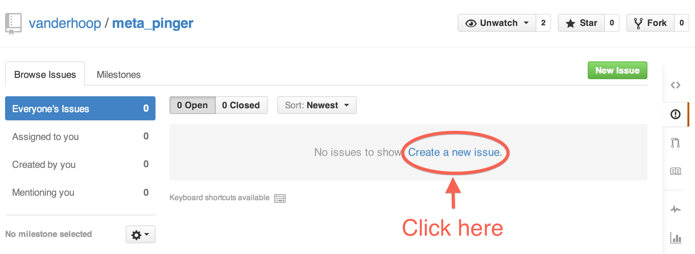
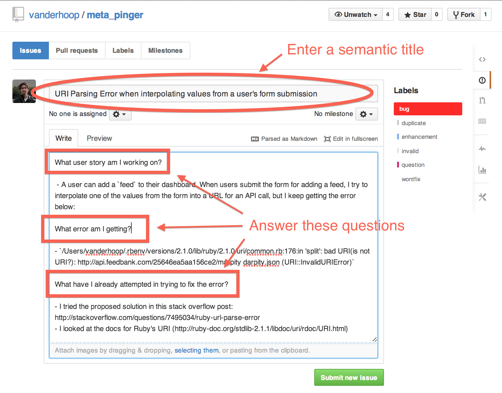
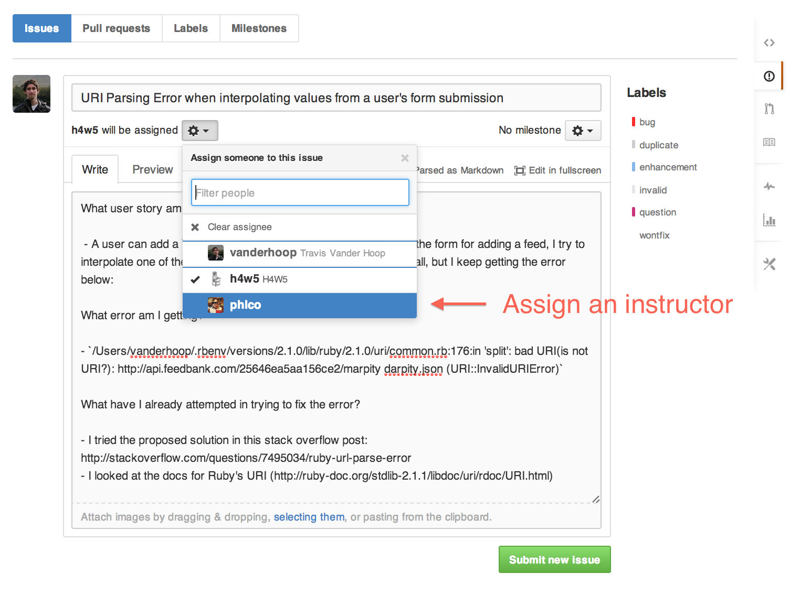
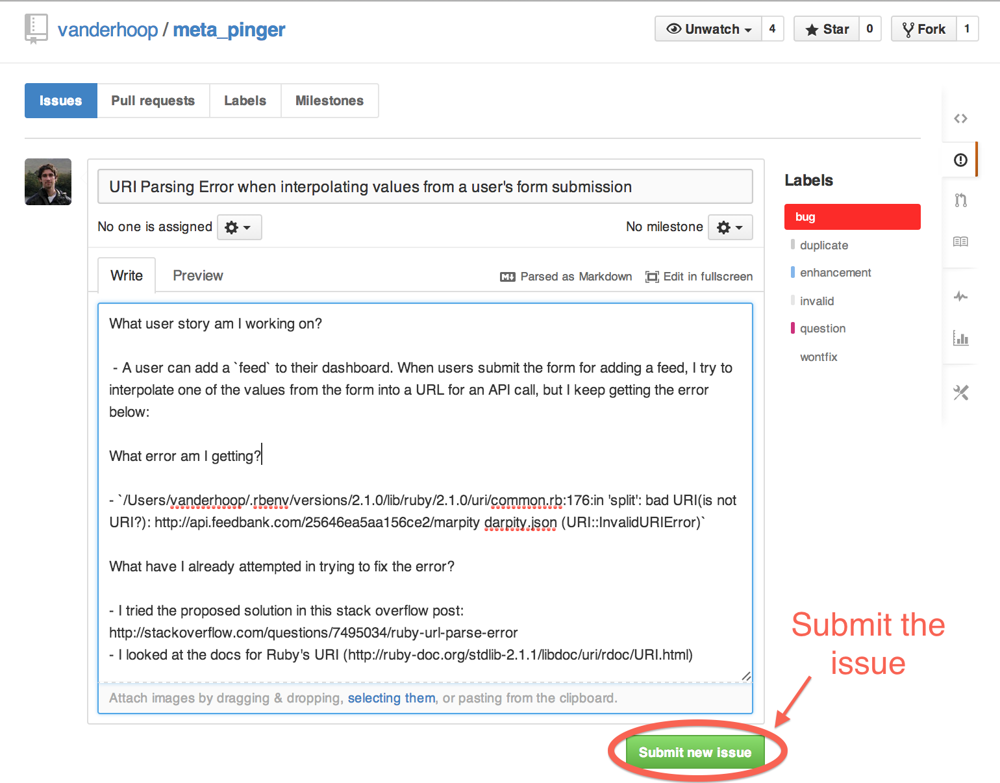

## GitHub Issues Submission

You will be submitting any requests for project help via GitHub issues. This 
document is a walkthru for how to do that.

### Setup

For GitHub Issues to work, it is necessary that:

1. you're working in a git repo that has a remote copy available on GitHub,
2. the instructors are **[collaborators](https://help.github.com/articles/adding-collaborators-to-a-personal-repository/)**
   on your project, and
3. you include, at the very least, the **magic words**.

### The Magic Words

The Magic Words are the minimum necessary information to allow people to help 
you with your problem. By including them in your issue / request for help, 
you effectively onboard the developer community (in this case, your instructors)
to your application.

1. What User Story (or feature) are you working on?
1. What error are you getting?
1. How have you attempted to fix your error?

### Creating Issues

#### Step 1 - Click 'Issues' Within Your Project Repo

___

#### Step 2 - Click 'Create a new issue'

___

#### Step 3 - Describe the problem

- Always begin with **the magic words**.
- Include enough information that it's possible to *reproduce the error*.
- Include links to any research you've done to tackle the issue, and any 
  screenshots as necessary.
- *Write your issue in Markdown!*

___

#### Step 4 - Assign an Instructor to the Issue

___

#### Step 5 - Submit the Issue

